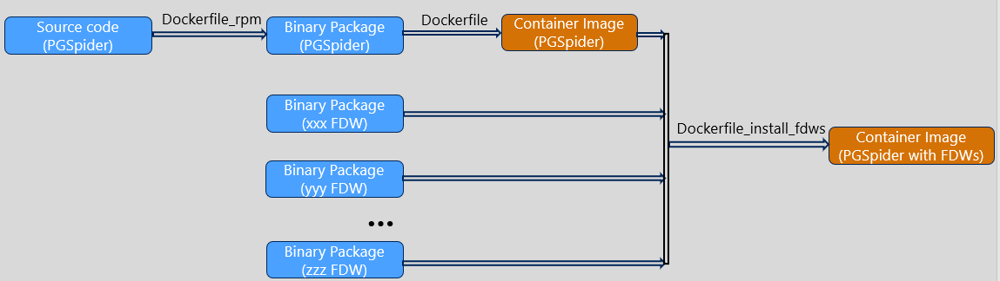
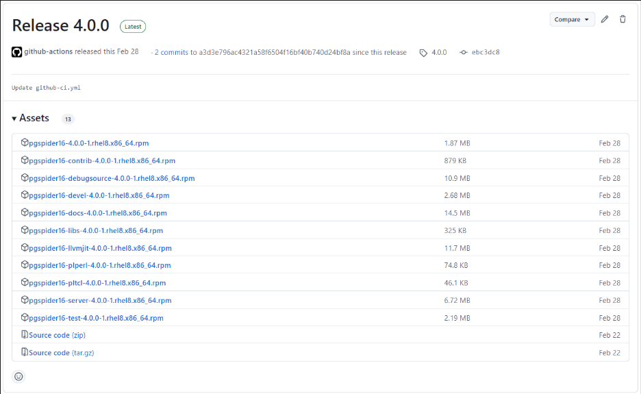
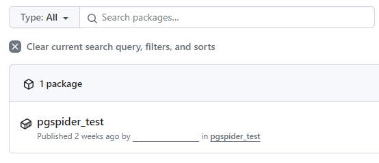
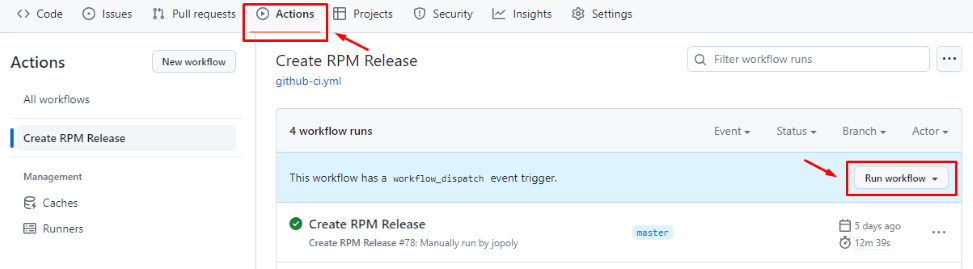

Usage of PGSpider docker image and PGSpider RPM packages
=====================================

The image below illustrates the process of building Docker images from source code and binary packages. First, the source code is used to build binary packages. These binary packages are then used to create the Docker image of PGSpider. Next, to create the Docker image PGSpider with FDWs, the FDW binary packages need to be installed into the Docker image PGSpider. As a result we have two Docker images, one is the PGSpider Docker image and the other is the PGSpider Docker image with FDWs.



- Create PGSpider RPM packages. Refer [Here](#creating-pgspider-rpm-packages)
	- RPM package is puiblished on the Assets of Release of PGSpider repository.
- Create PGSpider docker image from PGSpider RPM packages. Refer [Here](#creating-pgspider-docker-images)
	- The PGSpider RPM package is required. It must be released first.
	- The PGSpider docker image is published on the Packages Registry of PGSpider repository.
- Create PGSspider docker image with specific FDWs. Refer [Here](#creating-customized-pgspider-image-with-fdws)
	- The PGSpider docker image and the FDW RPM package are required. It must be released first.
- Additionally, we also provide Github Actions for creating RPM packages and docker image for [PGSpider](#usage-of-github-actions).

Environment for creating rpm of PGSpider
=====================================
The description below is used in the specific Linux distribution RockyLinux8.
1. Docker
	- Install Docker
		```sh
		sudo yum install -y yum-utils
		sudo yum-config-manager --add-repo https://download.docker.com/linux/centos/docker-ce.repo
		sudo yum install -y docker-ce docker-ce-cli containerd.io
		sudo systemctl enable docker
		sudo systemctl start docker
		```
	- Enable the currently logged in user to use docker commands
		```sh
		sudo gpasswd -a $(whoami) docker
		sudo chgrp docker /var/run/docker.sock
		sudo systemctl restart docker
		```
	- Proxy settings (If your network must go through a proxy)
		```sh
		sudo mkdir -p /etc/systemd/system/docker.service.d
		sudo tee /etc/systemd/system/docker.service.d/http-proxy.conf << EOF
		[Service]
		Environment="HTTP_PROXY=http://proxy:port/"
		Environment="HTTPS_PROXY=http://proxy:port/"
		Environment="NO_PROXY=localhost,127.0.0.1"
		EOF
		sudo systemctl daemon-reload
		sudo systemctl restart docker
		```
2. Get the required files  
	```sh
	git clone https://github.com/pgspider/pgspider.git
	```

Creating PGSpider rpm packages
=====================================
1. File used here
	- rpm/*
	- rpm/PGSpider.spec
	- docker/env_rpm_optimize_image.conf
	- docker/Dockerfile_rpm
	- docker/create_rpm_binary.sh
2. Configure `docker/env_rpm_optimize_image.conf` file
	- Configure proxy (optional)
		```sh
		proxy: The ip address of proxy server.
		no_proxy: List of domains to exclude proxying.
		```
	- Configure the registry location to publish the package and version of the packages
		```sh
		ACCESS_TOKEN=						# Fill in the access token of your account. It will be used for authentication when publish docker image or packages to GitHub. Refer (https://docs.github.com/en/authentication/keeping-your-account-and-data-secure/managing-your-personal-access-tokens#creating-a-personal-access-token-classic) for how to create a access token.
		PGSPIDER_BASE_POSTGRESQL_VERSION=	# Base version of Postgres for PGSpider. For example: 16.
		PGSPIDER_RELEASE_VERSION=			# The release version of PGSpider. It used to version of PGSpider rpm package. For example: 4.0.0.
		PACKAGE_RELEASE_VERSION=1			# The number of times this version of the software has been packaged.
		OWNER_GITHUB=						# Owner of this repository on Gihub (For example: https://github.com/pgspider/sqlite_fdw. The owner is pgspider).
		PGSPIDER_PROJECT_GITHUB=			# Repository name of pgspider. Normally it is "pgspider". If you forked or import it into a new repository, it will be different).
		PGSPIDER_RELEASE_ID=				# Before using shell script, you need to create a release (with a tag name) on GitHub manually. And then you need to access into (https://docs.github.com/en/graphql/overview/explorer) then execute the below script to get release id (need to update **owner**, **name** and **tagName**)
		```
		```sh
		{
			repository(owner: "pgspider", name: "pgspider") {
					release(tagName: "4.0.0") {
					databaseId
					createdAt
				}
			}
		}
		```
3. Build execution
	```sh
	chmod +x docker/create_rpm_binary.sh
	./docker/create_rpm_binary.sh
	```
4. Confirmation after finishing executing the script
	- Terminal displays a success message. 
		```
		{"message":"201 Created"}
		...
		{"message":"201 Created"}
		```
	- RPM Packages are stored on the Assets of Release. For example:

		

Creating PGSpider docker images
=====================================
The PGSpider rpm packages are created [above](#creating-pgspider-rpm-packages) will be taken from the Assets of Release to build PGSpider image.
1. File used here
	- docker/env_rpm_optimize_image.conf
	- docker/Dockerfile
	- docker/docker-entrypoint.sh
	- docker/create_pgspider_image.sh

2. Configure `docker/env_rpm_optimize_image.conf` file (refer to [Creating PGSpider rpm packages](#creating-pgspider-rpm-packages) section).

3. Build execution
	```sh
	chmod +x docker/create_pgspider_image.sh
	./docker/create_pgspider_image.sh
	```

4. Confirmation after finishing executing the script
	The docker image are stored in Package of account.

	

Creating customized PGSpider image with FDWs
=====================================
1. File used here
	- docker/env_rpm_optimize_image.conf
	- docker/Dockerfile_install_fdws
	- docker/create_pgspider_with_fdw_image.sh
2. Configure `docker/env_rpm_optimize_image.conf` file
	- Configure proxy: Same [Configure of Creating PGSpider rpm packages](#creating-pgspider-rpm-packages)
	- Configure PGSpider base image and FDWs packages
		```sh
		BASEIMAGE= 							# Name of PGSpider image. Example: ghcr.io/pgspider/pgspider_test:latest
		SQLITE_FDW_URL_PACKAGE=				# Link to download sqlite_fdw rpm package from sqlite_fdw's package registry. Example: https://github.com/pgspider/sqlite_fdw/releases/download/v.2.4.0/sqlite_fdw_16-2.4.0-rhel8.x86_64.rpm
		SQLITE_FDW_ACCESS_TOKEN=			# Github's package are publish so no need use Access Token. Please leave it blank.
		...
		# Same for other FDWs
		```
3. Build execution
	```sh
	chmod +x docker/create_pgspider_with_fdw_image.sh
	./docker/create_pgspider_with_fdw_image.sh
	```
4. Confirmation after finishing executing the script  
The customized PGSpider image is created with the name `customized_pgspider`
	```sh
	$ docker images
	REPOSITORY                 TAG                IMAGE ID          CREATED                
	customized_pgspider        latest             a1ae1446e5f7      14 hours ago
	```
Usage of PGSpider image
=====================================
1. Pull PGSpider image from the Registry (Unnecessary if already available)  
	- If package registry on private mode. You need to login first.
		```sh
		echo $PASSWORD | docker login --username $USERNAME --password-stdin ghcr.io
		```
	- Then pull pgspider image.
		```sh
		docker pull ghcr.io/pgspider/pgspider:latest
		```
2. Start a PGSpider container instance
	- Via `psql`
		```sh
		$ docker run -it ghcr.io/pgspider/pgspider:latest
		psql (16.0)
		Type "help" for help.

		pgspider=#
		```
	- Via detach mode
		```sh
		$ docker run -d ghcr.io/pgspider/pgspider:latest DETACH_MODE
		```
	The default `pgspider` user and database are created in the entrypoint with initdb.
3. Forwarding Port
	```sh
	$ docker run -p 4813:4813 -d ghcr.io/pgspider/pgspider:latest DETACH_MODE
	$ psql -h 127.0.0.1 -p 4813 -U pgspider -d pgspider
	psql (16.0)
	Type "help" for help.

	pgspider=#
	```
4. Extend database name

	This optional environment variable can be used to define a different name for the default database that is created when the image is first started.
	```sh
	$ docker run -p 4813:4813 -e PGSPIDER_DB=new_db ghcr.io/pgspider/pgspider:latest DETACH_MODE
	$ psql -h 127.0.0.1 -p 4813 -U pgspider -d pgspider
	psql: error: connection to server at "127.0.0.1", port 4813 failed: FATAL:  database "pgspider" does not exist
	$ psql -h 127.0.0.1 -p 4813 -U pgspider -d new_db
	psql (16.0)
	Type "help" for help.

	new_db=#
	```
Usage of GitHub Actions
=====================================
1. Configure `.github/workflows/github-ci.yml` file, update value of the below variable (refer to [this section](#creating-pgspider-rpm-packages)):
	- OWNER_GITHUB
	- PGSPIDER_PROJECT_GITHUB
	- PGSPIDER_RELEASE_VERSION
	- PGSPIDER_BASE_POSTGRESQL_VERSION
	- PACKAGE_RELEASE_VERSION

2. Access to Actions tab and click on Run workflow.

	
